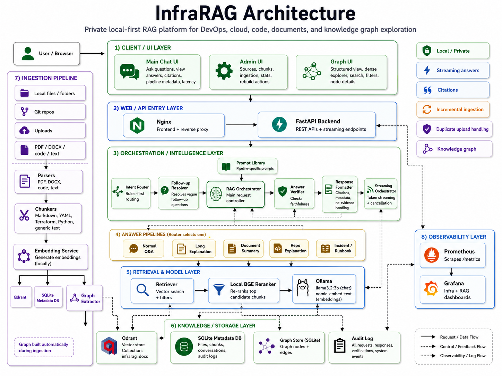
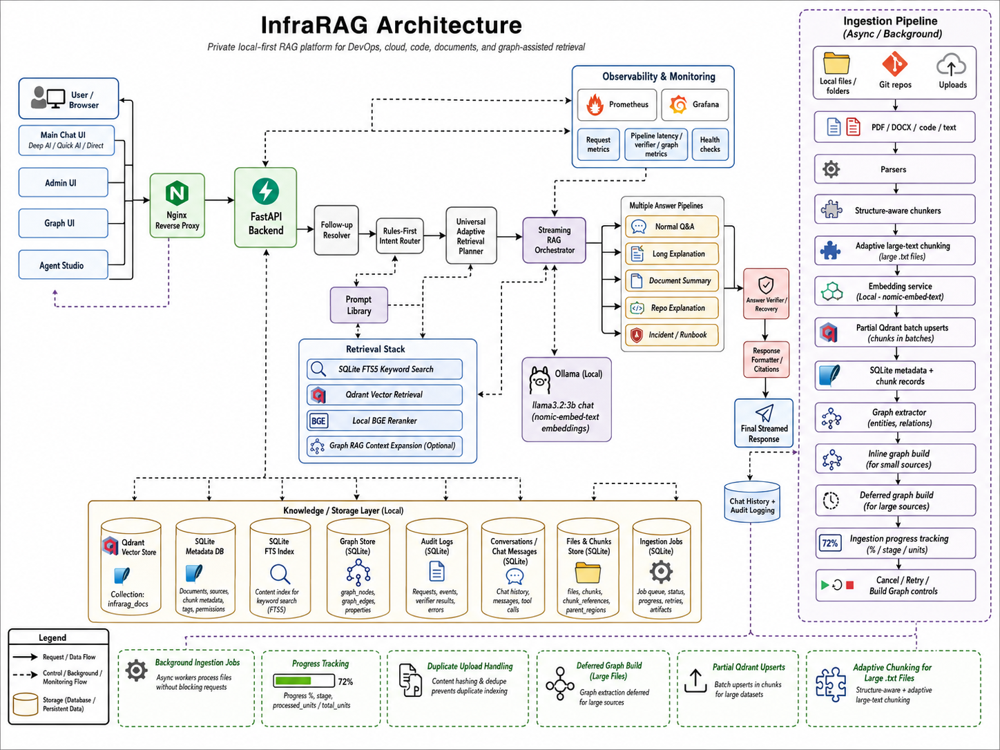

# InfraRAG

InfraRAG is a private, local-first Retrieval-Augmented Generation platform for DevOps, cloud, Terraform, runbooks, code repositories, PDFs, DOCX files, structured documents, and internal engineering knowledge bases.

It is designed as a production-style private AI assistant that can ingest engineering documents, retrieve relevant evidence, rerank context, route questions to the right answer pipeline, generate grounded answers with citations, build a knowledge graph for source inspection, stream responses, run database-driven agents, and keep an audit trail of what was asked and answered.

---

## Index

1. [InfraRAG Overview](#infrarag)
2. [Architecture Diagram](#architecture-diagram)
3. [Screenshots](#screenshots)
4. [What InfraRAG Does](#what-infrarag-does)
5. [Core Use Cases](#core-use-cases)
6. [Current Stack](#current-stack)
7. [Services](#services)
8. [Latest Features Added](#latest-features-added)
   - [1. Rules-First Intent Router](#1-rules-first-intent-router)
   - [2. Universal Adaptive Retrieval Planner](#2-universal-adaptive-retrieval-planner)
   - [3. Hybrid FTS5 + Qdrant Retrieval](#3-hybrid-fts5--qdrant-retrieval)
   - [4. Deep AI, Quick AI, and Direct Modes](#4-deep-ai-quick-ai-and-direct-modes)
   - [5. Runtime Performance Tuning Dashboard](#5-runtime-performance-tuning-dashboard)
   - [6. Per-Answer Tuning Metadata](#6-per-answer-tuning-metadata)
   - [7. Timing Breakdown per Answer](#7-timing-breakdown-per-answer)
   - [8. Backend-Enforced Runtime Defaults](#8-backend-enforced-runtime-defaults)
   - [9. Yes/No Relationship Query Shape](#9-yes-no-relationship-query-shape)
   - [10. Graph Context Decoupled from Base Retrieval](#10-graph-context-decoupled-from-base-retrieval)
   - [11. RAG Orchestrator](#11-rag-orchestrator)
   - [12. Prompt Library](#12-prompt-library)
   - [13. Multiple Answer Pipelines](#13-multiple-answer-pipelines)
   - [14. Streaming Answer UI](#14-streaming-answer-ui)
   - [15. Latency Timer and Progress Bar](#15-latency-timer-and-progress-bar)
   - [16. Local BGE Reranker](#16-local-bge-reranker)
   - [17. Clickable Citations](#17-clickable-citations)
   - [18. Chat History Support](#18-chat-history-support)
   - [19. SQLite Persistence](#19-sqlite-persistence)
   - [20. Audit Logging](#20-audit-logging)
   - [21. Answer Verifier and Recovery Layer](#21-answer-verifier-and-recovery-layer)
   - [22. Admin UI](#22-admin-ui)
   - [23. Graph UI and Knowledge Graph](#23-graph-ui-and-knowledge-graph)
   - [24. Automatic Graph Build on Ingest](#24-automatic-graph-build-on-ingest)
   - [25. DOCX Ingestion](#25-docx-ingestion)
   - [26. Duplicate Upload Handling](#26-duplicate-upload-handling)
   - [27. Cancellation Support](#27-cancellation-support)
   - [28. Prometheus and Grafana Observability](#28-prometheus-and-grafana-observability)
   - [29. Async Ingestion Jobs and Large File Support](#29-async-ingestion-jobs-and-large-file-support)
   - [30. Ingestion Progress, Cancel, Retry, and Build Graph Controls](#30-ingestion-progress-cancel-retry-and-build-graph-controls)
9. [High-Level Request Flow](#high-level-request-flow)
10. [Question Answering Flow](#question-answering-flow)
11. [Ingestion Flow](#ingestion-flow)
12. [Structured Reference and Parent-Region Flow](#structured-reference-and-parent-region-flow)
13. [Knowledge Graph Flow](#knowledge-graph-flow)
14. [Agent Studio Flow](#agent-studio-flow)
15. [Project Structure](#project-structure)
16. [Important Backend Files](#important-backend-files)
17. [Supported File Types](#supported-file-types)
18. [Ports](#ports)
19. [Main URLs](#main-urls)
20. [How to Start InfraRAG](#how-to-start-infrarag)
21. [API Endpoints](#api-endpoints)
22. [Models Used](#models-used)
23. [Key Runtime Parameters](#key-runtime-parameters)
24. [Chunking Strategy](#chunking-strategy)
25. [Storage Model](#storage-model)
26. [SQLite Tables](#sqlite-tables)
27. [Qdrant Collection](#qdrant-collection)
28. [Example Questions](#example-questions)
29. [Monitoring](#monitoring)
30. [Current Strengths](#current-strengths)
31. [Current Limitations](#current-limitations)
32. [Production Improvements To Add Next](#production-improvements-to-add-next)
33. [Why This Project Matters](#why-this-project-matters)
34. [Thanks](#thanks)

---

## Architecture Diagram






The current architecture includes:

- Main Chat UI
- Admin UI
- Graph UI
- Agent Studio UI
- Nginx reverse proxy
- FastAPI backend
- Rules-first router
- Follow-up resolver
- Retrieval planner
- RAG orchestrator
- Streaming orchestrator
- Prompt library
- Multiple answer pipelines
- Hybrid FTS5 + Qdrant retrieval
- Structured reference retrieval
- Parent-region metadata
- Local BGE reranker
- Optional graph context expansion
- Ollama chat model and embedding model
- Qdrant vector database
- SQLite metadata/control database
- SQLite FTS5 keyword index
- SQLite graph store
- SQLite audit log
- Agent Studio tables and run timeline
- Prometheus and Grafana observability

---

## Screenshots


---

## What InfraRAG Does

InfraRAG turns private engineering knowledge into a searchable local AI assistant.

It can:

- ingest uploaded files, folders, local paths, Git repositories, PDFs, DOCX files, Markdown, text files, code, Terraform, YAML, JSON, CSV, SQL, logs, and runbooks
- accept uploads quickly by creating background ingestion jobs instead of blocking the browser request
- show ingestion status, stage, processed units, total units, and completion percentage in the UI
- cancel queued/running ingestion jobs and retry failed/cancelled ingestion jobs
- parse and chunk documents using structure-aware chunking where possible
- use adaptive large-file chunking for large `.txt` files such as books and manuals
- extract structured references such as `1:1`, `23:1`, `Chapter 1`, `Section 2.1`, and named references such as `Psalm 23`
- store structured references in SQLite through the `chunk_references` table
- store parent-region boundaries in SQLite through the `parent_regions` table
- generate embeddings locally using Ollama and `nomic-embed-text`
- write vectors to Qdrant in batches for large ingestion jobs
- store source metadata, chunk metadata, reference metadata, graph data, chat history, audit logs, and agent data in SQLite
- retrieve the most relevant chunks for a user question
- use FTS5 keyword retrieval, Qdrant vector retrieval, structured reference retrieval, or hybrid retrieval depending on query shape
- rerank retrieved chunks using a local BGE reranker when quality mode needs it
- route questions automatically to the correct answer pipeline
- plan retrieval using universal query-shape rules instead of source-specific hacks
- support Deep AI, Quick AI, and Direct response modes
- expose a runtime tuning dashboard for chunks, context characters, answer token budget, and graph chunks
- show per-answer tuning values so users know what parameters produced each answer
- show timing breakdown for planning, retrieval, graph expansion, context build, first token, Ollama generation, audit save, and total latency
- avoid slow LLM planner calls for common factual, relationship, follow-up, document, repo, and incident questions through rules-first routing
- generate answers using Ollama and `llama3.2:3b`
- stream answers token-by-token in the UI where supported
- show pipeline metadata such as pipeline name, confidence, router reason, verifier status, graph status, tuning settings, and latency
- provide clickable citations linked to source files, chunks, and PDF page numbers where available
- keep chat history in a ChatGPT-style interface
- support request cancellation from the UI
- build a local knowledge graph for ingested sources
- defer graph build for large sources so vector RAG becomes usable first
- show graph nodes and relationships in a dedicated Graph UI
- create and run agents through Agent Studio
- store agent definitions in SQLite instead of hardcoding agents in source code
- enforce agent source access on the backend using metadata filters
- expose infrastructure and RAG metrics through Prometheus and Grafana

---

## Core Use Cases

InfraRAG is useful for:

- explaining private repositories
- asking questions about Terraform modules
- understanding AWS, Kubernetes, CI/CD, and DevOps documentation
- answering relationship questions such as whether one concept is part of another
- summarising uploaded PDFs, DOCX files, and books
- searching internal runbooks
- explaining incidents and troubleshooting steps
- inspecting source/chunk relationships through a graph view
- testing structured-reference retrieval against long documents
- comparing retrieval quality and latency between Deep AI, Quick AI, and Direct modes
- building private domain-specific agents over selected knowledge sources
- demonstrating local AI, RAG, observability, graph inspection, and DevOps platform engineering skills

---

## Current Stack

| Layer | Tool |
|---|---|
| Frontend | Static HTML / JavaScript |
| Admin UI | Static HTML / JavaScript |
| Graph UI | Static HTML / JavaScript / Cytoscape.js |
| Agent Studio UI | Static HTML / JavaScript |
| Backend | FastAPI |
| LLM Runtime | Ollama |
| Chat Model | `llama3.2:3b` |
| Embedding Model | `nomic-embed-text` |
| Vector Database | Qdrant |
| Keyword Search | SQLite FTS5 |
| Reranker | Local BGE reranker |
| Persistent Metadata | SQLite |
| Ingestion Jobs | SQLite-backed job table + in-process background worker |
| Structured References | SQLite `chunk_references` |
| Parent Regions | SQLite `parent_regions` |
| Graph Store | SQLite `graph_nodes` and `graph_edges` |
| Agent Store | SQLite `agents`, `agent_sources`, `agent_runs`, `agent_run_events` |
| Reverse Proxy | Nginx |
| Metrics | Prometheus |
| Dashboards | Grafana |
| Runtime | Docker Compose |

---

## Services

InfraRAG runs as a multi-container Docker Compose application.

Main services:

1. `frontend`
2. `backend`
3. `ollama`
4. `qdrant`
5. `nginx`
6. `prometheus`
7. `grafana`

---

## Latest Features Added

### 1. Rules-First Intent Router

InfraRAG has a rules-first intent router.

It decides whether a user request should go to:

- normal RAG Q&A
- long explanation
- full document summary
- Terraform/repository/code explanation
- incident or runbook troubleshooting

The router avoids LLM planner calls for many common cases:

- direct factual questions
- yes/no relationship or classification questions
- `who`, `what`, `where`, `when`, and `which` questions
- CV/profile/document lookups
- story or character questions
- GitHub repo/name/list questions
- follow-ups such as `elaborate the above`
- numbered follow-ups such as `explain point 2`
- incident/debug/error questions
- repo/code/file explanation questions

This reduces routing latency and avoids wasting 30-90 seconds on the LLM planner for simple questions.

---

### 2. Universal Adaptive Retrieval Planner

InfraRAG separates answer routing from retrieval planning.

`router.py` decides the answer pipeline.

`retrieval_planner.py` decides how to retrieve evidence.

The retrieval planner uses universal query-shape rules instead of hardcoding behavior for specific sample questions.

Current query shapes include:

- `normal_qa`
- `direct_question`
- `conceptual_question`
- `entity_lookup`
- `yes_no_relationship`
- `comparison`
- `exact_phrase`
- `section_summary`
- `structured_reference`
- `overview`
- `troubleshooting`
- `code_explanation`
- `list_or_examples`
- `how_to_steps`

This allows InfraRAG to handle new documents and new domains without adding one-off rules for every question.

---

### 3. Hybrid FTS5 + Qdrant Retrieval

InfraRAG supports hybrid retrieval.

Retrieval can use:

- Qdrant vector search
- SQLite FTS5 keyword search
- SQLite structured-reference lookup
- both FTS5 and Qdrant together
- optional neighbour chunk expansion
- optional reranking
- optional graph context expansion

The system chooses retrieval behavior based on query shape.

| Query shape | Retrieval behavior |
|---|---|
| `entity_lookup` | Keyword-first hybrid retrieval |
| `yes_no_relationship` | Keyword-first hybrid retrieval |
| `exact_phrase` | FTS5 phrase search, vector disabled |
| `structured_reference` | SQLite reference metadata lookup, then fallback to hybrid retrieval |
| `comparison` | Balanced multi-entity hybrid retrieval |
| `troubleshooting` | Keyword-first hybrid search with nearby chunks |
| `code_explanation` | Keyword-first hybrid search for filenames/symbols/code chunks |
| `normal_qa` | Vector + reranker by default in Deep AI |

This improves retrieval quality because exact terms such as `CI/CD`, `Terraform`, error codes, filenames, symbols, references, and named entities are not left only to vector similarity.

---

### 4. Structured Reference Retrieval

InfraRAG now includes structured-reference extraction and retrieval.

During ingestion, InfraRAG detects references such as:

```text
1:1
23:1
Chapter 1
Section 2.1
Article 5
Psalm 23
Genesis chapter 1
```

It stores them in SQLite using the `chunk_references` table.

At query time, questions such as:

```text
Explain Section 2.1
Summarise Chapter 1
Explain Psalm 23
```

can trigger structured-reference retrieval before falling back to vector/hybrid retrieval.

This is designed to improve long structured documents where simple vector search is not reliable.

Current status:

- metadata table exists
- ingestion populates `chunk_references`
- retrieval can detect structured-reference queries
- fallback trace is available when metadata lookup fails
- parent-region naming still needs improvement for messy long text files

---

### 5. Parent-Region Indexing

InfraRAG now stores parent regions in SQLite through the `parent_regions` table.

A parent region represents a larger logical area of a document, such as:

- a chapter
- a section
- a document heading
- a detected reference-number reset region
- a fallback reference region

Parent-region metadata includes:

- `parent_id`
- `source_id`
- `parent_type`
- `parent_title`
- `parent_key`
- `start_chunk_index`
- `end_chunk_index`
- `confidence`
- `metadata_json`

This helps future retrieval understand that chunks belong to larger document regions.

Current status:

- parent regions are created during ingestion
- metadata is persisted in SQLite
- bad global document titles are filtered
- weak headings are still possible for noisy/OCR-like sources
- real book/chapter/section naming needs more work for messy sources

---

### 6. Deep AI, Quick AI, and Direct Modes

The main UI supports three answer modes.

| Mode | Purpose | Typical behavior |
|---|---|---|
| Deep AI | Best quality/speed balance | More context, hybrid retrieval, reranker ON, Ollama answer |
| Quick AI | Faster answer | Smaller retrieval, shorter context, reranker often OFF, Ollama answer |
| Direct | Fastest lookup | No Ollama for simple lookups, returns evidence snippet directly |

Current standard defaults:

| Mode | Chunk limit | Context chars | Answer tokens | Graph chunks |
|---|---:|---:|---:|---:|
| Deep AI | 6 | 7000 | 350 | 3 |
| Quick AI | 3 | 3500 | 180 | 2 |
| Direct | 3 | 1200 | 0 | 2 |

Direct mode is designed for quick source-backed evidence lookup, not polished long-form answers.

---

### 7. Runtime Performance Tuning Dashboard

The Chat UI includes a performance tuning dashboard.

The dashboard lets the user adjust these values before asking a question:

- chunk limit
- context characters
- answer token budget
- graph chunks

The dashboard is useful for testing quality vs latency.

Example:

```text
Deep AI standard:
chunks = 6
context chars = 7000
answer tokens = 350
graph chunks = 3
```

The tuning applies to the next questions sent with those UI values. It does not permanently change the source code unless the backend defaults are also changed.

---

### 8. Per-Answer Tuning Metadata

Each answer can show the tuning values that produced it.

The answer metadata includes:

- chunk limit
- context chars
- answer tokens
- graph chunks
- retrieval speed
- pipeline used
- retriever used
- retrieval mode
- query shape
- reranker status
- latency

This makes answer comparison easier.

---

### 9. Timing Breakdown per Answer

Each answer can include timing details for:

- planning time
- retrieval time
- graph expansion time
- context build time
- time to first token
- Ollama generation time
- audit save time
- total latency

This makes it clear where the bottleneck is. In current local runs, Ollama generation is usually the slowest part.

---

### 10. Backend-Enforced Runtime Defaults

InfraRAG has backend defaults for normal Q&A runtime tuning.

If the frontend does not send tuning parameters, the backend still applies safe defaults:

```text
Deep AI:
chunk limit = 6
context chars = 7000
answer tokens = 350
graph chunks = 3

Quick AI:
chunk limit = 3
context chars = 3500
answer tokens = 180
graph chunks = 2

Direct:
chunk limit = 3
context chars = 1200
answer tokens = 0
graph chunks = 2
```

The backend clamps runtime values to safe limits:

```text
chunk limit: 1 to 16
context chars: 1000 to 30000
answer tokens: 0 to 2000
graph chunks: 0 to 8
```

---

### 11. Yes/No Relationship Query Shape

InfraRAG detects yes/no relationship questions without calling the LLM planner.

Examples:

```text
Is CI/CD part of DevOps?
Is Terraform an IaC tool?
Is Kubernetes used for orchestration?
Can Prometheus monitor services?
Does this document mention GitHub Actions?
```

These questions route to normal Q&A using rules-first logic, and retrieval uses keyword-first hybrid search.

---

### 12. Graph Context Decoupled from Base Retrieval

Graph context expansion is separated from base retrieval timing.

The flow is:

```text
base retrieval first
→ optional graph expansion after retrieval
→ separate graph_ms timing
```

This makes the timing dashboard more accurate:

- retrieval time shows core FTS5/Qdrant/reranker retrieval
- graph time shows only graph context expansion

Graph context remains optional and defaults OFF for speed.

---

### 13. RAG Orchestrator

A central RAG orchestrator controls the main answer flow.

It coordinates:

- routing
- follow-up resolution
- retrieval
- reranking
- prompt selection
- chat history
- citations
- answer verification
- recovery logic
- response formatting
- audit logging

This keeps the backend cleaner and makes new pipelines easier to add.

---

### 14. Prompt Library

Prompts are separated into a dedicated prompt library.

This controls:

- normal answer style
- long explanation style
- document summary style
- Terraform/repo/code explanation style
- incident/runbook style
- citation behavior
- `No evidence found` behavior
- denial recovery behavior
- verifier behavior
- formatting rules

The prompt library includes stricter evidence rules so the model does not falsely say `No evidence found` when citations exist.

---

### 15. Multiple Answer Pipelines

InfraRAG supports multiple answer pipelines instead of one generic RAG flow.

Current pipeline types:

- normal RAG Q&A
- long explanation
- full document/book summary
- Terraform/repo/code explanation
- incident/runbook troubleshooting

This is better than forcing every question through the same prompt.

---

### 16. Streaming Answer UI

The main UI supports streaming answers from `/ask-stream`.

Streaming is used for the main answer generation path, so users can see text arriving instead of waiting silently for the full answer.

Some fallback paths, such as verifier correction or recovery, may still appear after the first draft if they run as a second pass.

---

### 17. Latency Timer and Progress Bar

The UI includes:

- live latency timer in seconds
- progress label
- progress percentage
- compact progress bar
- final latency display

This helps show whether the request is routing, retrieving, generating, verifying, recovering, or completed.

---

### 18. Local BGE Reranker

InfraRAG has a local reranker layer.

The flow is:

1. Qdrant retrieves a larger candidate set
2. BGE reranker scores the candidates locally
3. only the best chunks are passed to Ollama

This improves answer quality because the LLM receives stronger context.

---

### 19. Clickable Citations

Answers support clickable citations.

Citations can point back to:

- source file
- source ID
- source path
- chunk index
- page number for PDFs where available
- retrieved evidence text

This is important because private RAG must prove where the answer came from.

---

### 20. Chat History Support

InfraRAG has chat history support.

The UI supports:

- new chat
- previous chats list
- opening old conversations
- deleting conversations
- recent conversation context for follow-up questions

This moves the app closer to a ChatGPT-style private assistant.

---

### 21. SQLite Persistence

InfraRAG uses SQLite as its local control database.

SQLite stores:

- source metadata
- uploaded file records
- ingestion job status and progress
- chunk metadata
- keyword index / FTS5 tables
- structured references
- parent regions
- chat conversations
- chat messages
- audit logs
- graph nodes
- graph edges
- knowledge sources
- agent definitions
- agent-source assignments
- agent run history
- agent run events
- summary jobs

The database is stored under the backend data volume.

---

### 22. Audit Logging

InfraRAG includes an audit layer.

The audit trail captures:

- user question
- generated answer
- intent
- pipeline used
- sources used
- model used
- timestamp
- latency
- verifier result
- graph context status where available
- runtime tuning values where available
- detailed timing breakdown where available

This is useful for enterprise-style traceability.

---

### 23. Answer Verifier and Recovery Layer

InfraRAG includes an answer verifier.

The verifier checks whether complex answers are supported by retrieved evidence.

The system also has a generic evidence-denial recovery path:

```text
retrieval found citations
→ model says "No evidence found" or "not mentioned"
→ recovery prompt runs against the same context
→ citations are preserved if useful evidence exists
```

This reduces false `No evidence found` answers.

Normal Q&A usually skips verifier for speed, but denial verification/recovery can run when the model denies evidence despite having citations.

---

### 24. Admin UI

The Admin UI is styled to match the main InfraRAG UI.

It supports:

- source list
- source type
- file type
- source status
- chunk count
- source ID
- last ingested timestamp
- view chunks
- re-ingest source
- delete source
- upload visibility
- dark theme aligned with the main app
- ingestion status panel
- ingestion progress percentage
- current ingestion stage
- processed/total unit counts
- Refresh
- Cancel Ingestion
- Retry Failed
- Build Graph
- Rebuild Graph for All Sources

---

### 25. Graph UI and Knowledge Graph

InfraRAG includes a Graph UI as a main page beside Chat, Admin, and Agent Studio.

Main pages:

1. Main Chat UI
2. Admin UI
3. Graph UI
4. Agent Studio UI

The Graph UI is used to inspect and debug the knowledge base structure.

It shows:

- file nodes
- chunk nodes
- chapter nodes
- section nodes
- concept nodes
- service nodes
- resource nodes
- symbol nodes
- contains relationships
- mentions relationships
- defines relationships
- next relationships
- related_to relationships

The Graph UI includes:

- dark/light theme toggle
- source selector
- search
- node-type filters
- relationship filters
- structured view
- dense explorer
- Graph Mode toggle
- interactive zoom/pan/layout
- node details
- citation opening
- source-scoped graph views

Current graph behavior is mainly for observability, trust, debugging, and knowledge-base inspection. Graph-assisted retrieval exists as an optional context expansion path, but the system is still primarily vector/hybrid RAG.

---

### 26. Automatic Graph Build on Ingest

InfraRAG builds graph data during ingestion for normal-sized sources.

When a new or changed small/medium file is ingested:

```text
parse file
→ chunk file
→ enrich chunks with references and parent metadata
→ embed chunks
→ upsert chunks to Qdrant
→ save source/chunk/reference/parent metadata to SQLite
→ build graph nodes and edges
→ save graph rows to SQLite
→ rebuild keyword index
```

For large sources, graph build can be deferred:

```text
large source
→ vector ingestion first
→ source becomes searchable
→ graph can be built later from Admin UI
```

This avoids blocking large file ingestion on graph extraction.

---

### 27. DOCX Ingestion

InfraRAG supports Word `.docx` ingestion.

DOCX files can be uploaded from the main UI and ingested into:

- SQLite source metadata
- SQLite chunk metadata
- Qdrant vector store
- SQLite graph tables
- SQLite keyword index

DOCX support is useful for CVs, resumes, design documents, runbooks, project notes, and internal business documents.

Legacy `.doc` files are not currently supported unless converted to `.docx`, `.pdf`, or text first.

---

### 28. Duplicate Upload Handling

Upload handling detects duplicate files by hash.

Expected behavior:

```text
duplicate upload found
→ check existing source_id
→ skip duplicate vector re-ingestion
→ build graph for existing source if graph is missing or stale
→ return duplicate_files + graph_built metadata
```

This avoids creating repeated source entries while still fixing missing graph rows for existing uploads.

---

### 29. Cancellation Support

The UI supports cancelling active answer generation and ingestion jobs.

For answer generation, the backend uses a cancel registry to stop long-running requests where possible.

For ingestion, the Admin UI can mark a queued/running ingestion job as cancelled. The ingestion loop checks cancellation between chunks and cleans partial Qdrant vectors for the source where possible.

Cancellation is useful for:

- long explanations
- slow verifier runs
- document summary jobs
- accidental large prompts
- wrong source selection
- accidental large file ingestion
- duplicate ingestion jobs

---

### 30. Prometheus and Grafana Observability

InfraRAG includes observability for both infrastructure/API health and RAG behavior.

Prometheus scrapes backend `/metrics`.

Grafana can show:

- total requests
- request rate
- backend memory
- backend CPU
- 5xx errors
- endpoint latency
- HTTP status codes
- RAG questions
- RAG pipeline usage
- graph context enabled
- graph chunks added
- no-evidence answers
- verifier verdicts
- Ollama timeouts
- average RAG answer latency by pipeline

This makes the app easier to demonstrate as a production-style AI/DevOps system.

---

### 31. Async Ingestion Jobs and Large File Support

InfraRAG supports background ingestion jobs.

Older flow:

```text
upload file
→ save file
→ parse
→ chunk
→ embed
→ write to Qdrant
→ save SQLite metadata
→ build graph
→ return response
```

This worked for small files, but large files could block the backend, freeze the Admin UI, or cause upstream errors.

Current flow:

```text
upload file
→ save file quickly
→ create ingestion job
→ return job_id immediately
→ background worker performs ingestion
→ UI polls job status
```

InfraRAG tracks ingestion jobs in SQLite through the `ingestion_jobs` table.

Job states include:

- `queued`
- `running`
- `done`
- `failed`
- `cancelled`

Large `.txt` files use adaptive chunking.

Current large text rule:

```text
if .txt file >= 1 MB:
    chunk_size = 5000 characters
    overlap = 500 characters
else:
    use default chunking
```

This avoids creating thousands of tiny chunks for large books and manuals.

---

### 32. Ingestion Progress, Cancel, Retry, and Build Graph Controls

The Admin UI includes ingestion job controls.

New Admin UI controls:

- Refresh
- Cancel Ingestion
- Retry Failed
- Build Graph
- Rebuild Graph for All Sources

The ingestion status panel shows:

- job status
- current stage
- progress percentage
- processed units
- total units
- error message if failed
- graph result when available

Example status:

```text
running 35%
Stage: embedding:bible.txt
Progress: 340 / 967
```

The backend saves ingestion progress fields:

- `stage`
- `total_units`
- `processed_units`
- `progress_percent`
- `heartbeat_at`

Correct behavior:

```text
Upload accepted: file.txt. Indexing started in background...
Indexing running: embedding:file.txt 340/967 35%
Indexing completed. Chunks: 967
```

---

### 33. Agent Studio

InfraRAG includes an Agent Studio layer.

Agent Studio is designed as a builder platform, not a hardcoded demo page.

Agents are stored in SQLite as data records, not hardcoded in source code.

Agent Studio supports:

- agent list
- selected agent details
- assigned sources
- agent instructions
- agent status such as draft/active/published
- run box
- answers
- citations
- run timeline
- audit-style run events

Backend agent functionality includes:

- `knowledge_sources`
- `agents`
- `agent_sources`
- `agent_runs`
- `agent_run_events`

Agent access is backend-enforced through allowed `source_id` filtering and metadata, not only frontend filtering.

Current agent direction:

```text
Agents dashboard
→ Create agent form
→ Select data sources
→ Assign sources
→ Set instructions
→ Test chat
→ View run timeline
→ Audit log
```

---

## High-Level Request Flow

```text
User
  |
  v
Frontend UI
  |
  v
Nginx
  |
  v
FastAPI Backend
  |
  v
Follow-up Resolver
  |
  v
Rules-First Intent Router
  |
  +--> Optional LLM Planner only when rules are not enough
  |
  v
RAG Orchestrator / Streaming Orchestrator
  |
  +--> Universal Adaptive Retrieval Planner
  |
  +--> Structured Reference Lookup in SQLite
  |
  +--> Parent-Region Metadata Lookup in SQLite
  |
  +--> SQLite FTS5 Keyword Search
  |
  +--> Query Embedding using Ollama / nomic-embed-text
  |
  +--> Qdrant Candidate Retrieval
  |
  +--> Optional BGE Reranking
  |
  +--> Optional Graph Context Expansion
  |
  +--> Context Compacting
  |
  +--> Prompt Library
  |
  +--> Ollama / llama3.2:3b
  |
  +--> Optional Verifier / Recovery Layer
  |
  +--> Citation Formatter
  |
  +--> SQLite Chat History
  |
  +--> SQLite Audit Log
  |
  v
Frontend Answer with Metadata, Tuning Values, Timing, Progress, and Citations
```

---

## Question Answering Flow

```text
Question
  |
  v
Check if follow-up
  |
  v
Resolve standalone question if needed
  |
  v
Choose answer pipeline
  |
  +--> rules_first when obvious
  |
  +--> llm_planner fallback when ambiguous
  |
  v
Choose retrieval plan
  |
  +--> query shape
  |
  +--> retrieval mode
  |
  +--> keyword/vector/reference/reranker/neighbour settings
  |
  v
Retrieve candidate chunks
  |
  +--> SQLite chunk_references for structured references
  |
  +--> SQLite FTS5 for keywords
  |
  +--> Qdrant for vector search
  |
  v
Rerank chunks with BGE where enabled
  |
  v
Optionally expand with graph context
  |
  v
Compact context using runtime tuning limit
  |
  v
Build pipeline-specific prompt
  |
  v
Stream answer from Ollama or return Direct snippet
  |
  v
Optionally verify/recover
  |
  v
Save chat + audit + timing metadata
  |
  v
Show answer + citations + timing + tuning values
```

---

## Ingestion Flow

InfraRAG uses asynchronous background ingestion.

```text
Files / Folders / Uploads / PDFs / DOCX / Repos
  |
  v
Upload / Ingest API
  |
  v
Save file or resolve path
  |
  v
Create ingestion job in SQLite
  |
  v
Return job_id immediately
  |
  v
Background Ingestion Worker
  |
  v
File Discovery
  |
  v
Parser
  |
  v
Adaptive Chunker
  |
  v
Reference + Parent Metadata Enrichment
  |
  v
Embedding Service
  |
  v
Partial Qdrant Upserts
  |
  v
SQLite Source + Chunk + Reference + Parent Records
  |
  v
SQLite FTS5 Keyword Index
  |
  +--> Small source: build graph inline
  |
  +--> Large source: defer graph build
```

The UI polls the ingestion job and shows:

```text
queued → running → done / failed / cancelled
```

For large files, the UI also shows:

```text
stage
processed_units
total_units
progress_percent
```

---

## Structured Reference and Parent-Region Flow

```text
Parsed text / chunks
  |
  v
Reference Extractor
  |
  +--> numbered references: 1:1, 23:1, 2.1
  +--> explicit references: Chapter 1, Section 2.1, Article 5
  +--> named references in queries: Psalm 23, Genesis chapter 1
  |
  v
Chunk metadata enrichment
  |
  +--> reference_labels
  +--> references
  +--> section_number
  +--> subsection_start / subsection_end
  +--> heading
  +--> parent_title
  +--> parent_id
  +--> prev_chunk_index / next_chunk_index
  |
  v
SQLite chunk_references
  |
  v
Parent Region Indexer
  |
  +--> detects larger logical regions
  +--> stores start/end chunk boundaries
  +--> stores confidence and metadata_json
  |
  v
SQLite parent_regions
  |
  v
Structured Reference Retriever
  |
  +--> tries metadata lookup first
  +--> uses context matching where possible
  +--> falls back to hybrid retrieval when needed
```

---

## Knowledge Graph Flow

```text
Ingested chunks
  |
  v
Graph Extractor
  |
  +--> file nodes
  +--> chunk nodes
  +--> chapter nodes
  +--> section nodes
  +--> concept nodes
  +--> service nodes
  +--> resource nodes
  +--> symbol nodes
  |
  v
Graph Store in SQLite
  |
  v
Graph API
  |
  v
Graph UI with Cytoscape.js
```

For large files, graph build can be deferred so vector/hybrid RAG is available first. The Admin UI can trigger graph rebuild later for a selected source or for all active sources.

---

## Agent Studio Flow

```text
User opens Agent Studio
  |
  v
Agents Dashboard
  |
  +--> list agents from SQLite
  +--> create/edit agent records
  +--> set instructions/status
  |
  v
Knowledge Source Selection
  |
  +--> source metadata from SQLite
  +--> source access assignment through agent_sources
  |
  v
Run Agent
  |
  +--> backend loads agent config
  +--> backend gets allowed source_ids
  +--> retrieval is filtered by allowed sources
  +--> answer generated with citations
  +--> agent run saved
  +--> run events saved
  |
  v
Agent Studio UI
  |
  +--> answer
  +--> citations
  +--> run timeline
  +--> audit/debug metadata
```

---

## Project Structure

Current project tree summary:

```text
infrarag/
├── README.md
├── architecture_diagram.png
├── docker-compose.yml
├── backend/
│   ├── Dockerfile
│   ├── requirements.txt
│   └── app/
│       ├── main.py
│       ├── router.py
│       ├── retrieval_planner.py
│       ├── hybrid_retrieve.py
│       ├── reference_extractor.py
│       ├── parent_region_indexer.py
│       ├── keyword_index.py
│       ├── source_profile.py
│       ├── rag_orchestrator.py
│       ├── streaming_orchestrator.py
│       ├── prompts.py
│       ├── retrieve.py
│       ├── reranker.py
│       ├── response_formatter.py
│       ├── answer_verifier.py
│       ├── audit.py
│       ├── chat_history.py
│       ├── followup_resolver.py
│       ├── query_planner.py
│       ├── metadata_db.py
│       ├── qdrant_client.py
│       ├── embedding_service.py
│       ├── uploads.py
│       ├── pipeline.py
│       ├── pipelines/
│       ├── ingest.py
│       ├── ingestion_jobs.py
│       ├── ingestion_progress.py
│       ├── incremental_ingest.py
│       ├── delete_sync.py
│       ├── git_connector.py
│       ├── pdf_parser.py
│       ├── docx_parser.py
│       ├── text_parser.py
│       ├── text_chunker.py
│       ├── code_parser.py
│       ├── code_chunker.py
│       ├── context_utils.py
│       ├── cancel_registry.py
│       ├── summary_jobs.py
│       ├── graph_api.py
│       ├── graph_extractor.py
│       ├── graph_store.py
│       ├── graph_retrieval.py
│       ├── rag_metrics.py
│       ├── state_store.py
│       └── agents/
├── docs/
│   ├── runbooks/
│   └── uploads/
├── frontend/
│   ├── index.html
│   ├── admin.html
│   ├── graph.html
│   └── agents.html
├── monitoring/
│   ├── prometheus.yml
│   └── grafana/
│       ├── provisioning/
│       └── dashboards/
├── nginx/
│   └── nginx.conf
└── data volumes managed by Docker Compose
```

---

## Important Backend Files

| File | Purpose |
|---|---|
| `main.py` | FastAPI entrypoint and API routes, including runtime tuning query parameters and router registration |
| `router.py` | Rules-first router that decides which answer pipeline to use |
| `retrieval_planner.py` | Universal retrieval planner that decides query shape and retrieval mode |
| `hybrid_retrieve.py` | Executes FTS5, Qdrant, structured-reference retrieval, clustering, neighbour expansion, and reranking |
| `reference_extractor.py` | Extracts references from chunks and queries; enriches chunks with reference metadata |
| `parent_region_indexer.py` | Builds larger parent-region boundaries and stores region metadata |
| `keyword_index.py` | SQLite FTS5 keyword search helper |
| `source_profile.py` | Source profiling helper used by adaptive retrieval |
| `query_planner.py` | Optional LLM planner fallback for ambiguous questions |
| `followup_resolver.py` | Resolves vague follow-ups such as `elaborate the above` |
| `rag_orchestrator.py` | Non-streaming RAG answer controller |
| `streaming_orchestrator.py` | Streaming answer controller used by the UI |
| `prompts.py` | Central prompt library |
| `retrieve.py` | Retrieval entrypoint that calls adaptive retrieval and optional graph expansion |
| `reranker.py` | Local BGE reranking |
| `context_utils.py` | Builds compact context and citations |
| `response_formatter.py` | Formats no-evidence and response objects |
| `answer_verifier.py` | Verifies and repairs unsupported or false-denial answers |
| `audit.py` | Saves audit events |
| `chat_history.py` | Conversation and message handling |
| `metadata_db.py` | SQLite metadata, files, ingestion jobs, chunks, references, parent regions, audit, graph, agents, and history storage |
| `qdrant_client.py` | Qdrant wrapper |
| `embedding_service.py` | Embedding generation |
| `uploads.py` | File and folder upload support |
| `pipeline.py` | Ingestion pipeline, adaptive chunking, reference enrichment, parent-region indexing, partial Qdrant upserts, graph deferral |
| `ingestion_jobs.py` | Background ingestion job lifecycle, retry, cancel, startup recovery |
| `ingestion_progress.py` | Ingestion progress tracking, percentage updates, and cancellation checks |
| `incremental_ingest.py` | Incremental ingestion support |
| `delete_sync.py` | Delete/sync logic for local and Git sources |
| `git_connector.py` | Git repository ingestion support |
| `pdf_parser.py` | PDF parsing |
| `docx_parser.py` | DOCX parsing |
| `text_parser.py` | Text, Markdown, JSON, CSV, config parsing |
| `code_parser.py` | Code parsing |
| `text_chunker.py` | Text chunking |
| `code_chunker.py` | Code-aware chunking |
| `graph_api.py` | Graph API endpoints |
| `graph_extractor.py` | Builds graph nodes and edges from chunks |
| `graph_store.py` | Stores and retrieves graph nodes/edges in SQLite |
| `graph_retrieval.py` | Adds optional graph-related chunks to RAG context |
| `rag_metrics.py` | Custom Prometheus RAG metrics |
| `cancel_registry.py` | Request cancellation support |
| `summary_jobs.py` | Document summary job tracking |
| `agents/` | Agent Studio API and runtime modules |

---

## Supported File Types

InfraRAG currently supports these file types for ingestion:

| Type | Extensions |
|---|---|
| PDF | `.pdf` |
| Word document | `.docx` |
| Markdown | `.md` |
| Text | `.txt`, `.rst`, `.log` |
| Config | `.ini`, `.cfg`, `.conf`, `.env` |
| Data/text structured files | `.json`, `.csv` |
| YAML | `.yml`, `.yaml` |
| Terraform / HCL | `.tf`, `.hcl` |
| Shell | `.sh`, `.bash` |
| SQL | `.sql` |
| JavaScript / TypeScript | `.js`, `.ts`, `.tsx`, `.jsx` |
| Python | `.py` |
| Java | `.java` |
| Go | `.go` |
| Rust | `.rs` |
| Dockerfile | `Dockerfile` |

Currently not supported directly:

- legacy `.doc`
- scanned image-only PDFs without OCR
- PowerPoint `.pptx`
- Excel `.xlsx`
- images as knowledge sources
- audio/video transcripts unless converted to text first

---

## Ports

| Service | Port | Purpose |
|---|---:|---|
| Frontend container | 3000 | Raw frontend container |
| Backend API | 8000 | FastAPI backend |
| Nginx app entry | 8080 | Main application URL |
| Ollama host port | 11435 | Host access to Ollama container |
| Qdrant HTTP | 6333 | Qdrant API |
| Qdrant gRPC | 6334 | Qdrant gRPC |
| Prometheus | 9090 | Metrics UI |
| Grafana | 3001 | Dashboard UI |

---

## Main URLs

| URL | Purpose |
|---|---|
| `http://localhost:8080` | Main InfraRAG chat app |
| `http://localhost:8080/admin.html` | Admin UI |
| `http://localhost:8080/graph.html` | Graph UI |
| `http://localhost:8080/agents.html` | Agent Studio UI |
| `http://localhost:9090` | Prometheus |
| `http://localhost:3001` | Grafana |
| `http://localhost:6333` | Qdrant API |

---

## How to Start InfraRAG

Clone the repo:

```bash
git clone https://github.com/ashroy6/infrarag.git
cd infrarag
```

### Start on a normal laptop / CPU machine

Use this on machines without an NVIDIA GPU:

```bash
docker compose up -d
```

### Start on an NVIDIA GPU machine

Use this on machines with NVIDIA GPU support configured in Docker:

```bash
docker compose -f docker-compose.yml -f docker-compose.gpu.yml up -d
```

The base `docker-compose.yml` is CPU-safe and works on all machines.  
The optional `docker-compose.gpu.yml` file is only for GPU-enabled machines.

### Pull required Ollama models

Run this after the containers are up:

```bash
docker compose exec ollama ollama pull nomic-embed-text
docker compose exec ollama ollama pull llama3.2:3b
```

### Open the app

```text
http://localhost:8080
```

### Open the admin page

```text
http://localhost:8080/admin.html
```

### Open the graph page

```text
http://localhost:8080/graph.html
```

### Open Agent Studio

```text
http://localhost:8080/agents.html
```

### Useful local observability pages

Prometheus:

```text
http://localhost:9090
```

Grafana:

```text
http://localhost:3001
```

### Check container status

```bash
docker ps
```

### Check backend health

```bash
curl http://localhost:8000/health
```

### View live backend logs

```bash
docker logs -f infrarag-backend
```

 ### After cloning InfraRAG, each user must ingest their own files or upload documents through the UI. The GitHub repo contains the application code, not a prebuilt private knowledge base.

---

## API Endpoints

| Endpoint | Purpose |
|---|---|
| `GET /` | Backend status |
| `GET /health` | Health check |
| `GET /retrieve?q=...` | Retrieve chunks only |
| `GET /ask?q=...` | Non-streaming RAG answer flow |
| `GET /ask-stream?q=...` | Streaming RAG answer flow |
| `GET /ask-stream?q=...&retrieval_speed=normal` | Deep AI streaming answer |
| `GET /ask-stream?q=...&retrieval_speed=fast` | Quick AI streaming answer |
| `GET /ask-stream?q=...&retrieval_speed=direct` | Direct snippet/evidence answer where supported |
| `GET /ask-stream?...&retrieval_limit_override=6` | Runtime chunk limit override |
| `GET /ask-stream?...&max_context_chars=7000` | Runtime context character override |
| `GET /ask-stream?...&num_predict_override=350` | Runtime answer token budget override |
| `GET /ask-stream?...&graph_max_chunks=3` | Runtime graph chunk override |
| `POST /cancel` | Cancel active answer-generation request |
| `POST /upload` | Upload one file and create background ingestion job |
| `POST /upload-folder` | Upload folder and create background ingestion job |
| `POST /ingest/local` | Create background ingestion job for local path |
| `POST /ingest/git` | Clone/pull and ingest Git repo |
| `GET /ingestion-jobs` | List ingestion jobs |
| `GET /ingestion-jobs/{job_id}` | Get ingestion job status and progress |
| `POST /ingestion-jobs/{job_id}/cancel` | Cancel queued/running ingestion job |
| `POST /ingestion-jobs/{job_id}/retry` | Retry failed/cancelled ingestion job |
| `GET /citation` | Retrieve exact citation evidence |
| `GET /conversations` | List conversations |
| `GET /conversations/{id}/messages` | Get conversation messages |
| `PATCH /conversations/{id}` | Rename conversation |
| `DELETE /conversations/{id}` | Delete conversation |
| `GET /admin/stats` | Admin stats |
| `GET /admin/sources` | List sources |
| `GET /admin/chunks` | List chunks for a source |
| `POST /admin/reingest` | Re-ingest source through background ingestion job |
| `DELETE /admin/source` | Delete source |
| `POST /admin/source/{source_id}/build-graph` | Build graph for an already ingested source |
| `GET /graph/stats` | Graph stats |
| `GET /graph` | Graph data |
| `GET /graph/source/{source_id}` | Graph data for one source |
| `POST /graph/rebuild-source/{source_id}` | Rebuild graph for one source |
| `POST /graph/rebuild` | Rebuild graph for active sources |
| `GET /agents/health` | Agent Studio health check |
| `GET /agents/agents` | List agents |
| `POST /agents/agents` | Create agent |
| `GET /agents/agents/{agent_id}/sources` | List sources assigned to an agent |
| `POST /agents/agents/{agent_id}/sources` | Assign source to agent |
| `POST /agents/agents/{agent_id}/run` | Run selected agent |
| `GET /agents/runs` | List agent runs |
| `GET /agents/runs/{run_id}/events` | List agent run events |
| `POST /agents/knowledge-sources/upload` | Upload Agent Studio knowledge source |
| `GET /audits` | List audit logs |
| `GET /audits/export` | Export audit logs |
| `GET /metrics` | Prometheus metrics |

---

## Models Used

### Embedding Model

```text
nomic-embed-text
```

Used for:

- document embeddings
- query embeddings

### Chat Model

```text
llama3.2:3b
```

Used for:

- answering grounded questions
- long explanations
- document summaries
- repo and Terraform explanations
- verifier/recovery paths
- optional LLM planner fallback

### Reranker

```text
Local BGE reranker
```

Used for:

- reranking retrieved chunks before they are sent to the LLM

---

## Key Runtime Parameters

Important parameters are configured through `docker-compose.yml` environment variables, backend defaults, and optional per-request tuning from the UI.

| Parameter | Purpose |
|---|---|
| `CHAT_MODEL` | Main Ollama chat model |
| `EMBED_MODEL` | Embedding model |
| `PLANNER_ENABLED` | Enables/disables LLM planner fallback |
| `PLANNER_TIMEOUT_SECONDS` | Max planner wait time |
| `PLANNER_NUM_PREDICT` | Planner output token budget |
| `FOLLOWUP_RESOLVER_ENABLED` | Enables follow-up resolver |
| `FOLLOWUP_RESOLVER_TIMEOUT_SECONDS` | Max follow-up resolver wait |
| `NORMAL_QA_LIMIT` | Base final chunks for normal Q&A |
| `NORMAL_QA_NUM_PREDICT` | Base normal Q&A answer token budget |
| `LONG_EXPLANATION_LIMIT` | Final chunks for long explanation |
| `LONG_EXPLANATION_NUM_PREDICT` | Long explanation token budget |
| `REPO_EXPLANATION_LIMIT` | Final chunks for repo explanation |
| `REPO_EXPLANATION_NUM_PREDICT` | Repo explanation token budget |
| `CODE_FILE_NUM_PREDICT` | Exact file/code answer token budget |
| `INCIDENT_RUNBOOK_LIMIT` | Final chunks for incident/runbook |
| `INCIDENT_RUNBOOK_NUM_PREDICT` | Incident/runbook token budget |
| `DOC_SUMMARY_BATCH_SIZE` | Batch size for document summary |
| `DOC_SUMMARY_MAP_NUM_PREDICT` | Map-stage summary token budget |
| `DOC_SUMMARY_REDUCE_NUM_PREDICT` | Reduce-stage summary token budget |
| `VERIFY_COMPLEX_ANSWERS` | Enables verifier for complex pipelines |
| `NORMAL_QA_DENIAL_VERIFIER_ENABLED` | Enables verifier only when normal QA denies evidence despite citations |
| `VERIFIER_TIMEOUT_SECONDS` | Max verifier wait |
| `VERIFIER_NUM_PREDICT` | Verifier token budget |
| `MIN_SCORE_THRESHOLD` | Minimum retrieval confidence threshold |
| `MAX_CONTEXT_CHARS_PER_CHUNK` | Per-chunk context cap |
| `MAX_TOTAL_CONTEXT_CHARS` | Total context cap |
| `retrieval_speed` | Per-request mode: `normal`, `fast`, or `direct` |
| `retrieval_limit_override` | Per-request chunk limit override for normal Q&A |
| `max_context_chars` | Per-request total context character budget |
| `num_predict_override` | Per-request answer token budget override for normal Q&A |
| `graph_max_chunks` | Per-request graph expansion chunk budget |
| `MAX_INGEST_WORKERS` | Number of background ingestion workers, default `1` |
| `LARGE_TEXT_THRESHOLD_BYTES` | File size threshold for large `.txt` adaptive chunking, default `1000000` |
| `LARGE_TEXT_CHUNK_SIZE` | Large `.txt` chunk size, default `5000` characters |
| `LARGE_TEXT_CHUNK_OVERLAP` | Large `.txt` chunk overlap, default `500` characters |
| `QDRANT_UPSERT_BATCH_SIZE` | Number of vectors written to Qdrant per batch, default `100` |
| `GRAPH_BUILD_MAX_CHUNKS_INLINE` | Max chunks allowed for inline graph build, default `500` |

### Current Answer Mode Defaults

| Mode | Backend mode value | Chunk limit | Context chars | Answer tokens | Graph chunks | Reranker |
|---|---|---:|---:|---:|---:|---|
| Deep AI | `normal` | 6 | 7000 | 350 | 3 | ON |
| Quick AI | `fast` | 3 | 3500 | 180 | 2 | Usually OFF |
| Direct | `direct` | 3 | 1200 | 0 | 2 | OFF |

---

## Chunking Strategy

InfraRAG supports structure-aware chunking.

### Markdown

Chunked by headings where possible.

### Terraform

Chunked by logical Terraform blocks such as:

- `resource`
- `module`
- `variable`
- `output`
- `data`
- `provider`
- `terraform`

### Python

Chunked by function or class where possible.

### YAML

Chunked by logical top-level sections.

### PDF

Parsed page by page where possible, with page metadata preserved for citations.

### DOCX

Parsed from Word document body text into chunkable text.

### CSV / JSON

Currently parsed as text. This works for small files, but stronger table-aware retrieval is still needed.

### Fallback

If structure-aware chunking is not possible, InfraRAG falls back to fixed-size chunking.

Default fallback chunking:

```text
chunk_size = 1200 characters
overlap = 150 characters
```

### Large Text Files

Large `.txt` files use adaptive chunking.

Current rule:

```text
if .txt file size >= 1 MB:
    chunk_size = 5000 characters
    overlap = 500 characters
```

This is important for books and large text files because small chunks can create thousands of embedding calls and make ingestion too slow.

---

## Storage Model

InfraRAG separates raw files, vector data, keyword index data, metadata, graph data, agent data, and runtime logs.

| Storage | Purpose |
|---|---|
| `docs/` | Mounted local source knowledge |
| `/app/data/uploads` | Uploaded files inside backend data volume |
| `/app/data/repos` | Cloned Git repositories |
| Qdrant | Vector embeddings and searchable chunks |
| SQLite FTS5 | Keyword search index for exact terms, filenames, symbols, and entities |
| SQLite | Source records, ingestion jobs, progress status, chunk metadata, references, parent regions, chat history, audit logs, graph data, agent data |
| Docker volumes | Persistent container data |
| Prometheus volume/config | Metrics scraping |
| Grafana volume/config | Dashboards and visualisation |

---

## SQLite Tables

SQLite is one database file, usually:

```text
/app/data/infrarag.db
```

Current important tables include:

| Area | Tables | Purpose |
|---|---|---|
| Source metadata | `files` | Ingested source records, file hash, parser type, source group, security metadata |
| Chunk metadata | `chunks` | Chunk IDs, source IDs, chunk indexes, Qdrant point IDs, previews |
| Keyword search | `chunk_fts`, `chunk_fts_*`, `keyword_index_sources` | FTS5 keyword index and index state |
| Structured references | `chunk_references` | Extracted references such as `1:1`, `Section 2.1`, `Chapter 1` |
| Parent regions | `parent_regions` | Larger document regions with start/end chunk indexes |
| Chat history | `conversations`, `chat_messages` | Chat sessions and messages |
| Audit | `audit_logs` | Question/answer/pipeline/source/model/latency records |
| Ingestion | `ingestion_jobs` | Background ingestion job tracking |
| Summary | `summary_jobs` | Summary job tracking |
| Graph | `graph_nodes`, `graph_edges` | Knowledge graph nodes and relationships |
| Agent Studio | `knowledge_sources`, `agents`, `agent_sources`, `agent_runs`, `agent_run_events` | Agent builder, source assignment, run history, timeline |

---

## Qdrant Collection

Default collection:

```text
infrarag_docs
```

Each vector point can include metadata such as:

- source path
- source ID
- source type
- file type
- parser type
- chunk index
- chunk text
- page number where available
- page range where available
- tenant/source-group/agent metadata where enabled
- reference labels where available
- references where available
- section metadata where available
- heading and parent metadata where available
- previous and next chunk indexes where available

---

## Example Questions

After ingestion, you can ask:

### Document and Profile Questions

- What is this document about?
- Summarise this uploaded PDF.
- Summarise this uploaded DOCX.
- What are the key points in this profile?
- What certifications are listed in this document?
- What experience is mentioned in this CV or resume?
- Which projects are mentioned in this profile?
- Which source supports this answer?

### Repository and Code Questions

- What does this repo do?
- Explain this project structure.
- Explain this Python file.
- Explain this Terraform module.
- Which file defines this resource?
- Which file creates this infrastructure component?
- Explain this CI/CD workflow.
- What does this deployment script do?

### DevOps, Cloud, and Runbook Questions

- What is DevOps?
- Is CI/CD part of DevOps?
- Is Terraform an IaC tool?
- What are the main steps in this runbook?
- What caused this incident according to the runbook?
- What should I check first for this error?
- What rollback path is described in this document?
- Which AWS services are mentioned in this source?
- What monitoring or observability steps are described?

### Structured Document Questions

- Where does it say "In the beginning"?
- Explain Section 2.1 in simple terms.
- Summarise Chapter 1.
- What does Article 5 say?
- Explain Psalm 23 in simple terms.

### Legal / Business Document Questions

- What should be checked during contract review?
- What does the NDA say about confidentiality obligations?
- Which suppliers are listed in the contract register?
- Compare the legal checklist and supplier services agreement.

### Story, Book, and Long Document Questions

- Who is the main character in this story?
- What is the story about?
- Summarise chapter 1.
- Explain the main theme of this document.
- Elaborate the previous answer.
- Explain point 2 in detail.

### Performance Testing Questions

- Ask the same question in Deep AI and Quick AI and compare latency.
- Turn Graph Context ON and compare answer quality.
- Increase context chars and check whether quality improves.
- Lower answer tokens and check whether response becomes too short.

---

## Monitoring

InfraRAG includes monitoring through Prometheus and Grafana.

### Prometheus

Prometheus scrapes backend metrics from:

```text
/metrics
```

Open Prometheus:

```text
http://localhost:9090
```

### Grafana

Open Grafana:

```text
http://localhost:3001
```

Common first login:

```text
username: admin
password: admin
```

Grafana dashboard coverage can include:

- total requests
- requests per second
- 5xx errors per minute
- backend memory
- backend CPU
- request rate by endpoint
- endpoint p95 latency
- HTTP status codes
- RAG questions
- graph chunks added
- no-evidence answers
- Ollama timeouts
- average RAG answer latency by pipeline
- pipeline usage
- verifier verdicts
- graph context enabled

---

## Current Strengths

InfraRAG now demonstrates:

- private local RAG
- local LLM inference with Ollama
- local embeddings
- Qdrant vector search
- SQLite FTS5 keyword search
- hybrid keyword + vector retrieval
- structured reference extraction and retrieval
- parent-region metadata
- universal adaptive retrieval planning
- query-shape detection
- yes/no relationship detection
- local BGE reranking
- rules-first intent routing
- optional LLM planner fallback
- multiple answer pipelines
- prompt library separation
- Deep AI, Quick AI, and Direct modes
- runtime performance tuning dashboard
- per-answer tuning metadata
- detailed timing breakdown per answer
- backend-enforced runtime defaults
- streaming answer generation
- request cancellation
- answer verification
- denial recovery
- clickable citations
- chat history
- audit trail
- file and folder upload support
- asynchronous background ingestion jobs
- ingestion progress tracking with percentage, stage, processed units, and total units
- cancel ingestion support
- retry failed ingestion support
- large `.txt` adaptive chunking
- partial Qdrant upserts for large ingestion jobs
- graph build deferral for large sources
- Admin UI controls for Refresh, Cancel Ingestion, Retry Failed, Build Graph, and Rebuild Graph
- PDF ingestion
- DOCX ingestion
- Git/repo ingestion support
- incremental ingestion support
- duplicate upload handling
- delete/sync support
- Admin UI
- Graph UI
- Agent Studio UI
- SQLite-backed knowledge graph
- automatic graph build on ingest for smaller sources
- build-graph-later flow for large sources
- optional graph context expansion
- database-driven agents
- backend-enforced agent source filtering
- agent run timeline
- Prometheus metrics
- Grafana dashboard
- Docker Compose deployment

---

## Current Limitations

Current limitations:

- no authentication yet
- no role-based access control yet
- no production secret manager integration yet
- no HTTPS/TLS configuration yet
- no multi-user access isolation yet
- `.doc` legacy Word files are not supported directly
- scanned/image-only PDFs need OCR before ingestion
- PowerPoint and Excel ingestion are not supported yet
- CSV/table retrieval is still weak and needs table-aware parsing/retrieval
- very large corpora now have background ingestion and adaptive chunking, but still need stronger production queue management
- the current ingestion worker is still in-process inside FastAPI, not a dedicated queue worker
- graph build for very large sources should become a separate background graph job
- ingestion progress exists, but deeper per-file/per-stage telemetry can still improve
- some secondary LLM paths such as verifier/recovery may still appear after the first streamed draft
- local Ollama generation latency is still the main bottleneck
- Quick AI can be too short for some questions if answer token budget is too low
- answer quality gates need more formal tests
- graph-assisted retrieval is still early and optional
- graph is currently mostly for observability/debugging, not the primary retrieval engine
- structured reference retrieval works, but parent-region naming is still weak for messy long text/OCR-like files
- comparison retrieval can still pull noisy sources without stronger domain/source scoping
- full CI/CD pipeline can be improved further
- production deployment needs TLS, auth, backup, monitoring alerts, and access control

---

## Production Improvements To Add Next

Recommended next improvements:

1. Add authentication and user login
2. Add role-based access control
3. Add source-level permissions and access filters visibly in the UI
4. Add proper HTTPS/TLS
5. Add backup and restore for Qdrant and SQLite
6. Add stronger CI/CD tests
7. Add Docker Compose smoke tests in GitHub Actions
8. Add regression tests for known questions and expected citations
9. Add answer-quality gates for too-short Quick AI and long explanations
10. Add source/domain scoping for comparison questions
11. Add CSV/table-aware parsing and retrieval
12. Add stronger parent-region naming from raw parsed text before chunking
13. Add confidence fallback when structured-reference retrieval returns weak citations
14. Add source-type preference logic so concept questions prefer docs over CV/profile sources unless a CV/profile is selected
15. Add story/book neighboring-chunk retrieval improvements
16. Add better Graph-RAG retrieval using graph relationships
17. Replace in-process ingestion worker with a stronger persistent queue such as Celery, RQ, Dramatiq, or Arq
18. Add source deletion/rebuild from Admin UI
19. Add model and retrieval evaluation tests
20. Add confidence thresholds for `No evidence found`
21. Add deployment guide for VM or cloud server
22. Add production secrets handling
23. Add OCR support for scanned PDFs
24. Add PowerPoint and Excel ingestion
25. Add admin page for re-indexing, graph rebuilds, and corpus health
26. Add dedicated background graph build jobs
27. Add uploaded raw-file cleanup controls
28. Add ingestion job history cleanup
29. Add ingestion regression tests for large files such as books/manuals
30. Add source table columns for Vector Status, FTS Status, Reference Status, Parent Region Status, and Graph Status
31. Add model performance comparison dashboard for local Ollama models
32. Add per-pipeline latency budget alerts
33. Add configurable default tuning profiles from Admin UI
34. Add production deployment hardening for multi-user environments
35. Complete Agent Builder UI so users can create, edit, publish, and assign sources to agents from the browser
36. Add tools/actions/approval rules to Agent Studio

---

## Why This Project Matters

InfraRAG is not just a chatbot.

It demonstrates how to build a private engineering knowledge assistant over:

- code
- runbooks
- infrastructure documentation
- Terraform modules
- DevOps documentation
- CI/CD pipelines
- PDFs
- DOCX files
- internal repositories
- structured references
- graph-inspected knowledge bases
- agent-specific knowledge sources

It brings together:

- DevOps engineering
- platform engineering
- AI infrastructure
- local LLM operations
- retrieval-augmented generation
- vector databases
- keyword search
- hybrid retrieval
- reranking
- structured references
- parent-region indexing
- knowledge graphs
- agent runtime design
- observability
- Docker-based deployment
- background job processing
- auditability
- enterprise-style architecture thinking

---

## Thanks

Built by Ashish Dev as a local-first private AI/RAG platform for DevOps, cloud, code, documents, agents, structured retrieval, and engineering knowledge.
