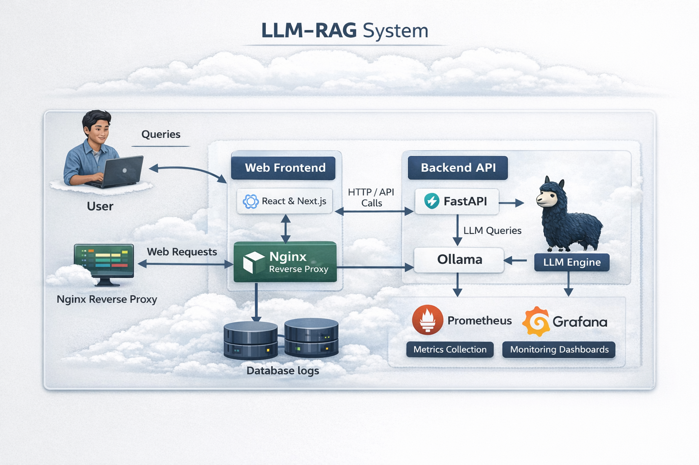
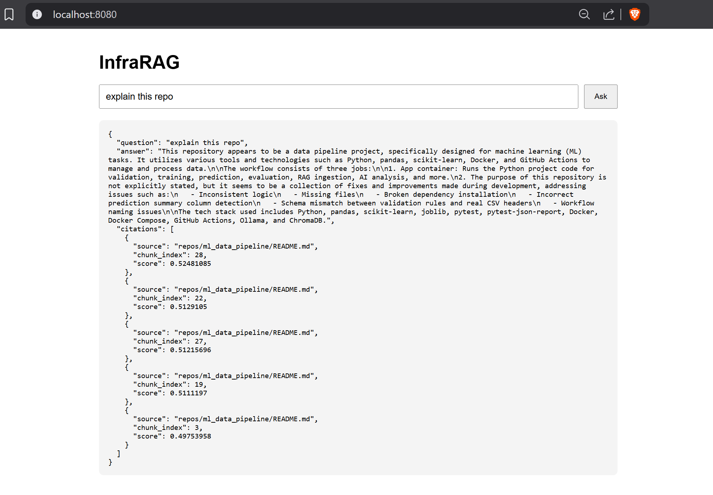

# InfraRAG

InfraRAG is a private, local-first Retrieval-Augmented Generation (RAG) system built for DevOps, cloud, Terraform, and engineering knowledge bases.

It combines:

- a **web frontend** for asking questions
- a **FastAPI backend** for retrieval and orchestration
- **Ollama** for local LLM inference and embeddings
- **Qdrant** for vector storage and similarity search
- **Nginx** as the reverse proxy
- **Prometheus** for metrics scraping
- **Grafana** for monitoring dashboards

The goal is to turn raw documentation, code repositories, runbooks, Terraform modules, and internal engineering notes into a searchable private AI assistant that can answer grounded questions with citations.

---

## Architecture Diagram



---

## What InfraRAG Does

InfraRAG lets you:

- ingest selected files and folders from a local `docs/` corpus
- chunk those files intelligently
- generate embeddings using `nomic-embed-text`
- store vectors and metadata in Qdrant
- retrieve the most relevant chunks for a question
- send retrieved context to Ollama
- generate grounded answers with source citations
- monitor the backend with Prometheus and Grafana

This makes it useful for:

- explaining private repos
- answering Terraform questions from real module docs
- searching internal runbooks
- explaining CI/CD workflows
- answering engineering questions from your own knowledge base

---

## Current Stack

### Core services

- **Frontend**: static HTML/JS UI
- **Backend**: FastAPI
- **LLM runtime**: Ollama
- **Embedding model**: `nomic-embed-text`
- **Chat model**: `llama3.2:3b`
- **Vector database**: Qdrant
- **Reverse proxy**: Nginx
- **Metrics**: Prometheus
- **Dashboards**: Grafana

### Container layout

InfraRAG runs as a multi-container Docker Compose application:

1. `frontend`
2. `backend`
3. `ollama`
4. `qdrant`
5. `nginx`
6. `prometheus`
7. `grafana`

---

## High-Level Request Flow

### Question answering flow

1. User opens the UI on port `8080`
2. User types a question
3. Frontend sends the request to `/api/ask`
4. Nginx routes `/api/*` to the backend
5. Backend creates an embedding for the query using Ollama
6. Backend queries Qdrant for the most relevant chunks
7. Backend builds a prompt using retrieved context
8. Backend sends the prompt to Ollama chat model
9. Ollama returns an answer
10. Backend returns the answer plus citations
11. Frontend displays the response

### Ingestion flow

1. Raw files live under the local `docs/` folder
2. You choose which files or folders to ingest
3. Backend reads those files
4. Files are chunked based on file structure where possible
5. Each chunk is embedded with `nomic-embed-text`
6. Embeddings plus metadata are stored in Qdrant

---

## Project Structure

```text
infrarag/
├── backend/
│   ├── Dockerfile
│   ├── requirements.txt
│   └── app/
│       ├── main.py
│       ├── ingest.py
│       └── retrieve.py
├── docs/
│   ├── aws/
│   ├── terraform/
│   ├── devops/
│   ├── repos/
│   └── runbooks/
├── frontend/
│   └── index.html
├── monitoring/
│   ├── prometheus.yml
│   └── grafana/
├── nginx/
│   └── nginx.conf
└── docker-compose.yml

```


# Folder Roles

## `backend/`

Contains the application logic.

### Main files
- `main.py` exposes API routes such as:
  - `/`
  - `/health`
  - `/retrieve`
  - `/ask`
  - `/metrics`

- `ingest.py`
  - Reads files from `docs/`
  - Chunks them
  - Embeds them
  - Stores them in Qdrant

- `retrieve.py`
  - Embeds the query
  - Searches Qdrant

## `docs/`

This is the raw knowledge source.

### Examples
- AWS docs repos
- Terraform module docs
- your own private GitHub repos
- runbooks
- CI/CD docs
- internal notes

## `frontend/`

Simple web UI for asking questions.

## `nginx/`

Routes traffic:

- `/` → frontend
- `/api/*` → backend

## `monitoring/`

Contains Prometheus configuration and Grafana persistence.

# Ports

| Service | Port | Purpose |
|---|---:|---|
| Frontend container | 3000 | Raw frontend container |
| Backend API | 8000 | FastAPI backend |
| Nginx app entry | 8080 | Main application URL |
| Ollama host port | 11435 | Host access to Ollama container |
| Qdrant | 6333 | Qdrant API |
| Qdrant gRPC | 6334 | Qdrant gRPC |
| Prometheus | 9090 | Metrics UI |
| Grafana | 3001 | Dashboard UI |

## Main App URL

http://localhost:8080

# Models Used

## Embedding model
`nomic-embed-text`

Used for:
- embedding documents
- embedding user queries

## Chat model
`llama3.2:3b`

Used for:
- answering questions from retrieved context

# Chunking Strategy

InfraRAG supports structure-aware chunking.

## Markdown
- chunked by headings where possible

## Terraform
- chunked by top-level blocks such as:
  - `resource`
  - `module`
  - `variable`
  - `output`
  - `data`
  - `provider`
  - `terraform`

## Python
- chunked by function or class using Python AST

## YAML
- chunked by logical top-level sections

## Fallback
If a chunk becomes too large, the system falls back to fixed-size chunking.

This gives better retrieval quality than blindly splitting everything by character count.

# How Selective Ingestion Works

InfraRAG does not need to ingest the whole `docs/` folder.

You can ingest only selected files or directories by passing them to `ingest.py`.

## Example
```bash
docker compose exec backend python app/ingest.py repos/ml_data_pipeline/src repos/ml_data_pipeline/README.md

```

## How Ingested Data Is Stored

Raw files remain in the `docs/` folder.

After ingestion, vectors are stored in Qdrant in the collection:

`infrarag_docs`

Each stored point includes metadata such as:
- source file path
- chunk index
- chunk text
- file type
- embedding vector

### Important distinction
- `docs/` = raw source knowledge
- `Qdrant` = vectorized searchable knowledge

## Example Commands

### Start the stack
```bash
docker compose up -d

```
## Example Questions

Once ingestion is complete, you can ask questions like:

- What does this repo do?
- How is `model.pkl` created?
- Which workflow runs training?
- What does `predict.py` do?
- How is the CI pipeline structured?
- What does this Terraform module create?
- Which file defines outputs for this module?
- What are the main steps in this README?

## Monitoring

InfraRAG includes basic monitoring support.

### Prometheus

Prometheus scrapes backend metrics from:

`/metrics`

Open Prometheus:

`http://localhost:9090`

### Grafana

Open Grafana:

`http://localhost:3001`

Default first login is commonly:

- username: `admin`
- password: `admin`

Grafana can be connected to Prometheus as a data source to visualize:

- request counts
- request latency
- backend availability
- API activity over time


## API Endpoints

### `GET /`
Returns a basic backend status message.

### `GET /health`
Health check endpoint.

### `GET /retrieve?q=...`
Returns retrieved chunks only.

### `GET /ask?q=...`
Runs the full RAG flow:

- query embedding
- vector search
- prompt building
- Ollama answer generation
- citations

### `GET /metrics`
Prometheus metrics endpoint.

## Current Strengths

InfraRAG already demonstrates:

- local private RAG
- Docker-based deployment
- vector search with Qdrant
- local embeddings and generation via Ollama
- selective ingestion
- structure-aware chunking
- basic citations
- frontend + backend separation
- monitoring integration

## Current Limitations

Current MVP limitations include:

- frontend is intentionally simple
- no authentication yet
- citations are basic
- no reranking yet
- no incremental file change detection yet
- no ingestion scheduler yet
- no advanced metadata filters yet
- no role-based access yet
- monitoring dashboards still need to be built in Grafana
- very large corpora need better curation and tuning


## Why This Project Matters

InfraRAG is not just a chatbot.

It demonstrates how to build a private engineering knowledge assistant that can operate over:

- code
- runbooks
- infrastructure docs
- Terraform modules
- DevOps documentation
- internal repos

This makes it a strong project for demonstrating:

- DevOps engineering
- platform engineering
- AI infrastructure
- RAG system design
- containerized application architecture
- local LLM integration
- production-style system thinking

## Screeshots


