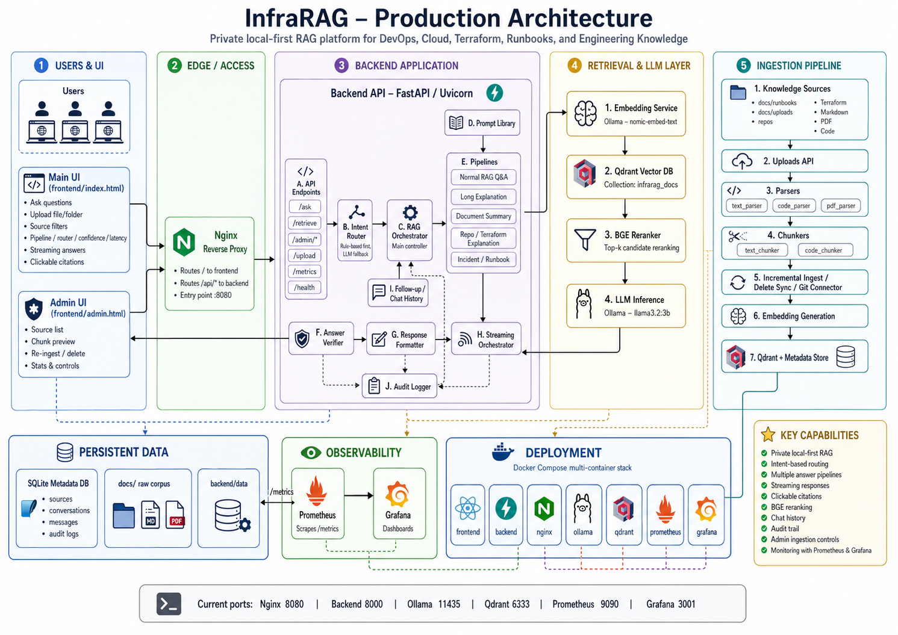
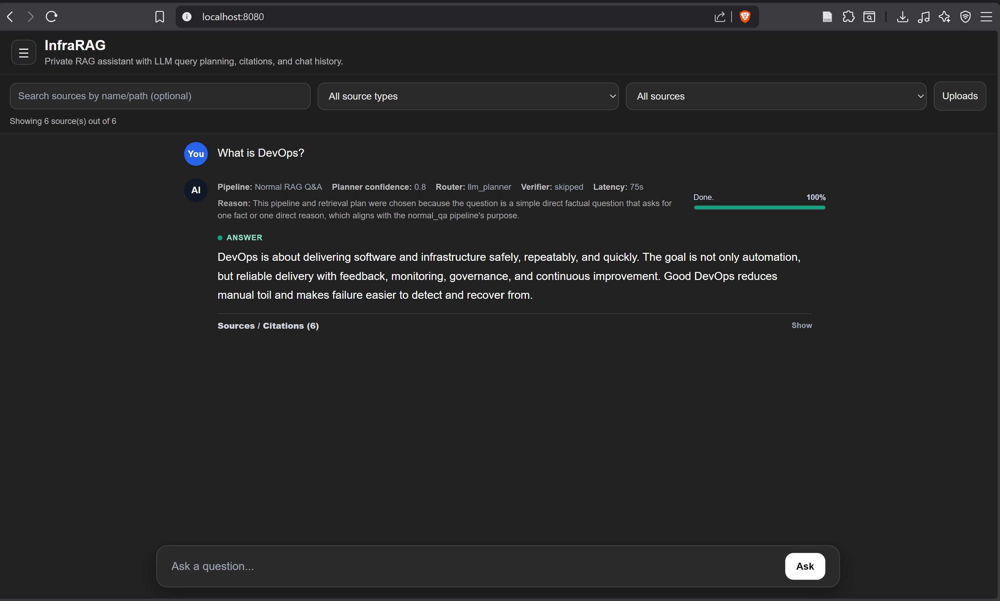
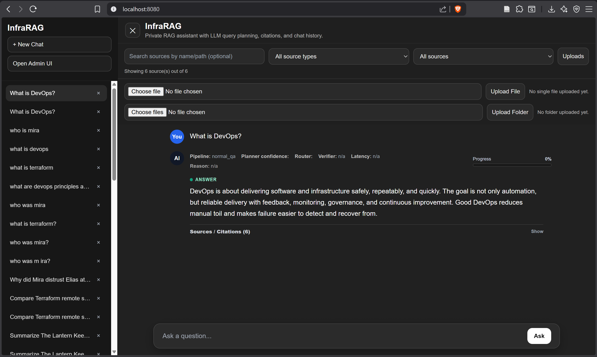
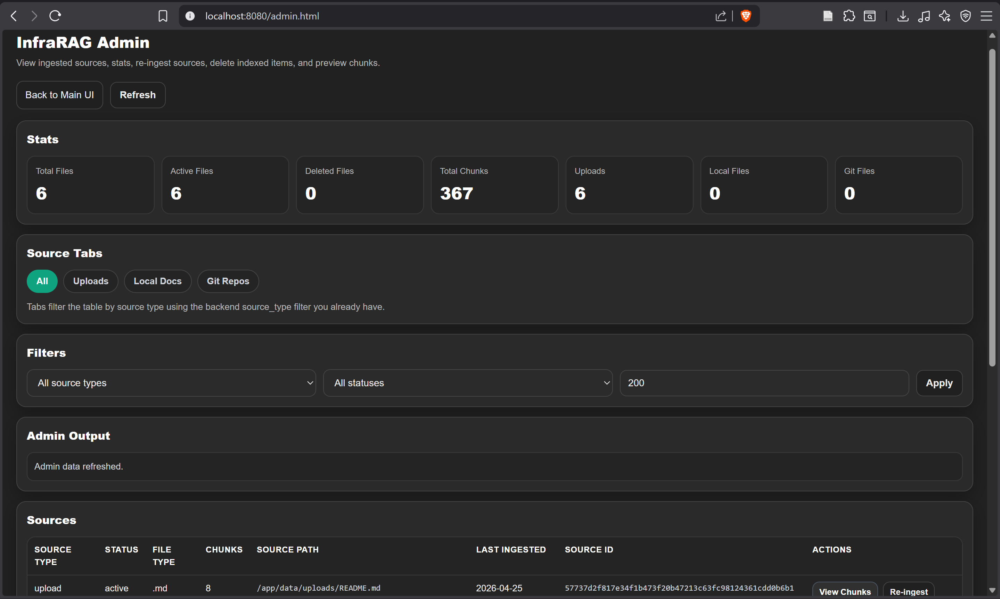
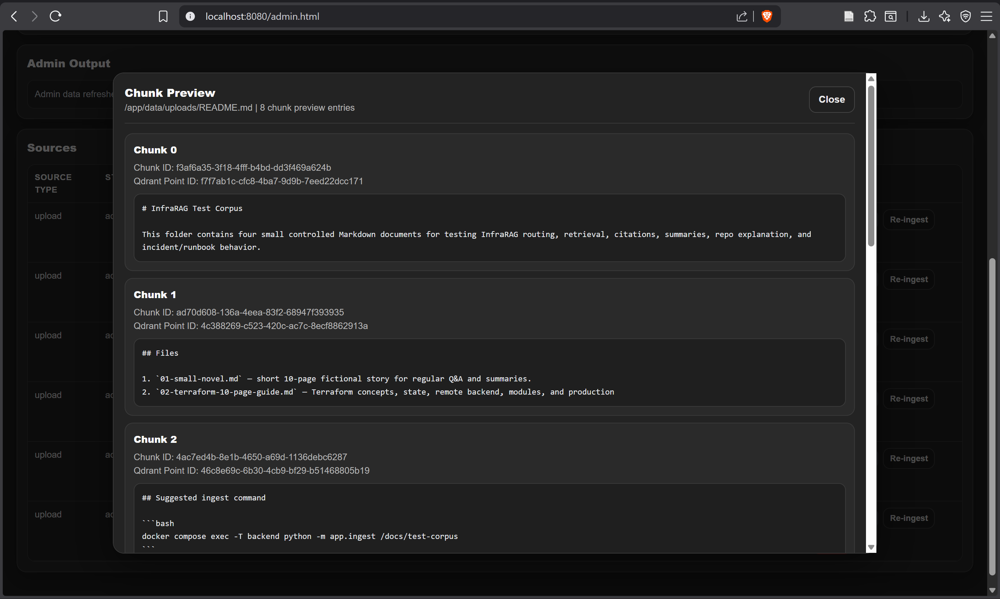

# InfraRAG

InfraRAG is a private, local-first Retrieval-Augmented Generation system for DevOps, cloud, Terraform, runbooks, code repositories, PDFs, and internal engineering knowledge bases.

It is designed as a production-style private AI assistant that can ingest engineering documents, retrieve relevant context, rerank evidence, route questions to the right answer pipeline, generate grounded answers with citations, and keep an audit trail of what was asked and answered.

---

## Index

1. [InfraRAG Overview](#infrarag)
2. [Architecture Diagram](#architecture-diagram)
3. [Screenshots](#screenhots)
4. [What InfraRAG Does](#what-infrarag-does)
5. [Core Use Cases](#core-use-cases)
6. [Current Stack](#current-stack)
7. [Services](#services)
8. [New Features Added](#new-features-added)
   - [1. Intent Router](#1-intent-router)
   - [2. RAG Orchestrator](#2-rag-orchestrator)
   - [3. Prompt Library](#3-prompt-library)
   - [4. Multiple Answer Pipelines](#4-multiple-answer-pipelines)
   - [5. Pipeline Metadata in UI](#5-pipeline-metadata-in-ui)
   - [6. Latency Timer](#6-latency-timer)
   - [7. Local BGE Reranker](#7-local-bge-reranker)
   - [8. Clickable Citations](#8-clickable-citations)
   - [9. Chat History Support](#9-chat-history-support)
   - [10. SQLite Persistence](#10-sqlite-persistence)
   - [11. Audit Logging](#11-audit-logging)
   - [12. Answer Verifier](#12-answer-verifier)
   - [13. Admin UI Improvements](#13-admin-ui-improvements)
   - [14. Cleaner Source and Upload UI](#14-cleaner-source-and-upload-ui)
9. [High-Level Request Flow](#high-level-request-flow)
10. [Question Answering Flow](#question-answering-flow)
11. [Ingestion Flow](#ingestion-flow)
12. [Project Structure](#project-structure)
13. [Important Backend Files](#important-backend-files)
14. [Ports](#ports)
15. [Main URLs](#main-urls)
16. [How to Start InfraRAG](#how-to-start-infrarag)
17. [Optional: Ingest Example Repo Files](#optional-ingest-example-repo-files)
18. [API Endpoints](#api-endpoints)
19. [Models Used](#models-used)
   - [Embedding Model](#embedding-model)
   - [Chat Model](#chat-model)
   - [Reranker](#reranker)
20. [Chunking Strategy](#chunking-strategy)
   - [Markdown](#markdown)
   - [Terraform](#terraform)
   - [Python](#python)
   - [YAML](#yaml)
   - [PDF](#pdf)
   - [Fallback](#fallback)
21. [Storage Model](#storage-model)
22. [Qdrant Collection](#qdrant-collection)
23. [Example Questions](#example-questions)
24. [Monitoring](#monitoring)
   - [Prometheus](#prometheus)
   - [Grafana](#grafana)
25. [Current Strengths](#current-strengths)
26. [Current Limitations](#current-limitations)
27. [Production Improvements To Add Next](#production-improvements-to-add-next)
28. [Why This Project Matters](#why-this-project-matters)
29. [Thanks](#thanks)

## Architecture Diagram



---

## Screenhots










## What InfraRAG Does

InfraRAG turns your private engineering knowledge into a searchable AI assistant.

It can:

- ingest local files, folders, uploaded files, PDFs, code, Terraform, YAML, Markdown, and runbooks
- parse and chunk documents using structure-aware chunking
- generate embeddings locally using Ollama and `nomic-embed-text`
- store vectors and metadata in Qdrant
- retrieve the most relevant chunks for a question
- rerank retrieved chunks using a local BGE reranker
- route questions automatically to the correct answer pipeline
- generate answers using Ollama and `llama3.2:3b`
- show pipeline metadata such as pipeline name, confidence, router reason, verifier status, and latency
- provide citations linked to source files, chunks, and pages where available
- store chat history and audit logs in SQLite
- expose metrics through Prometheus and Grafana

---

## Core Use Cases

InfraRAG is useful for:

- explaining private repositories
- asking questions about Terraform modules
- understanding AWS, Kubernetes, CI/CD, and DevOps documentation
- summarising uploaded PDFs and books
- searching internal runbooks
- explaining incidents and troubleshooting steps
- creating a private engineering knowledge assistant for a company
- demonstrating local AI, RAG, observability, and DevOps platform engineering skills

---

## Current Stack

| Layer | Tool |
|---|---|
| Frontend | Static HTML / JavaScript |
| Admin UI | Static HTML / JavaScript |
| Backend | FastAPI |
| LLM Runtime | Ollama |
| Chat Model | `llama3.2:3b` |
| Embedding Model | `nomic-embed-text` |
| Vector Database | Qdrant |
| Reranker | Local BGE reranker |
| Persistent Metadata | SQLite |
| Reverse Proxy | Nginx |
| Metrics | Prometheus |
| Dashboards | Grafana |
| Runtime | Docker Compose |

---

## Services

InfraRAG runs as a multi-container Docker Compose application.

Main services:

1. `frontend`
2. `backend`
3. `ollama`
4. `qdrant`
5. `nginx`
6. `prometheus`
7. `grafana`

---

## New Features Added

These are the latest major InfraRAG upgrades.

### 1. Intent Router

InfraRAG now has an intent router in the backend.

It decides whether a user request should go to:

- normal RAG Q&A
- long explanation
- full document summary
- Terraform or repository explanation
- incident or runbook troubleshooting

This removes the need for the user to manually choose the pipeline.

---

### 2. RAG Orchestrator

A central RAG orchestrator now controls the main answer flow.

It coordinates:

- routing
- retrieval
- reranking
- prompt selection
- chat history
- citations
- response formatting
- audit logging

This makes the backend cleaner and easier to extend.

---

### 3. Prompt Library

Prompts are now separated into a dedicated prompt library.

This keeps answer behaviour consistent across pipelines and controls:

- normal answer style
- long explanation style
- document summary style
- Terraform explanation style
- incident/runbook style
- citation rules
- `No evidence found` behaviour
- verifier and formatting rules

---

### 4. Multiple Answer Pipelines

InfraRAG now supports multiple answer pipelines instead of one generic RAG flow.

Current pipeline types:

- normal RAG Q&A
- long explanation
- full document/book summary
- Terraform/repo explanation
- incident/runbook troubleshooting

This is better than forcing every question through the same prompt.

---

### 5. Pipeline Metadata in UI

The frontend now shows visible pipeline metadata above the answer.

Displayed metadata includes:

- pipeline used
- router type
- planner confidence
- verifier status
- latency
- router reason

This makes the system easier to debug and easier to demo.

---

### 6. Latency Timer

The UI now includes a live latency timer.

It shows how long the response takes in seconds, so users can see whether the request is fast, slow, or stuck.

---

### 7. Local BGE Reranker

InfraRAG now has a reranker layer.

The flow is:

1. Qdrant retrieves a larger set of candidate chunks
2. BGE reranker scores the candidates locally
3. only the best chunks are passed to Ollama

This improves answer quality because the LLM receives stronger context.

---

### 8. Clickable Citations

Answers now support improved citations.

Citations can point back to:

- source file
- source path
- chunk
- page number for PDFs where available

This is important because private RAG must prove where the answer came from.

---

### 9. Chat History Support

InfraRAG now has chat history support through the backend.

The system can keep previous messages and use recent conversation context for follow-up questions.

This moves the app closer to a ChatGPT-style private assistant.

---

### 10. SQLite Persistence

InfraRAG uses SQLite for persistent metadata and history.

SQLite stores:

- source metadata
- uploaded file records
- ingestion status
- chat conversations
- chat messages
- audit logs

The database is stored under the backend data volume.

---

### 11. Audit Logging

InfraRAG now includes an audit layer.

The audit trail can capture:

- user question
- generated answer
- intent
- pipeline used
- sources used
- model used
- timestamp
- latency

This is useful for enterprise-style traceability.

---

### 12. Answer Verifier

An answer verifier layer has been added.

It can check whether an answer looks acceptable or needs revision.

This helps reduce weak answers and gives more visibility into answer quality.

---

### 13. Admin UI Improvements

The admin UI has been restyled to match the main InfraRAG UI.

Improvements include:

- darker theme
- similar font size
- consistent text colour
- cleaner layout
- better alignment with the main app style

---

### 14. Cleaner Source and Upload UI

The source filter and upload area has been simplified.

Changes include:

- fewer duplicate source controls
- one-line source filter layout
- equal-width source boxes
- upload box aligned with the filters
- removed unnecessary page up/down style clutter
- cleaner layout for demo and daily use

---

## High-Level Request Flow

### Question Answering Flow

```text
User
  |
  v
Frontend UI
  |
  v
Nginx
  |
  v
FastAPI Backend
  |
  v
Intent Router
  |
  v
RAG Orchestrator
  |
  +--> Query Embedding using Ollama / nomic-embed-text
  |
  +--> Qdrant Candidate Retrieval
  |
  +--> BGE Reranking
  |
  +--> Prompt Library
  |
  +--> Ollama / llama3.2:3b
  |
  +--> Answer Verifier
  |
  +--> Citation Formatter
  |
  +--> SQLite Audit Log
  |
  v
Frontend Answer with Metadata, Latency, and Citations
```

---

## Ingestion Flow

```text
Files / Folders / Uploads / PDFs / Repos
  |
  v
Parser
  |
  v
Chunker
  |
  v
Embedding Service
  |
  v
Qdrant Vector Store
  |
  v
SQLite Metadata Store
```

---

## Project Structure

Current project tree summary:

```text
infrarag/
├── architectural-diagram-infrarag.png
├── backend/
│   ├── Dockerfile
│   ├── requirements.txt
│   ├── data/
│   └── app/
│       ├── main.py
│       ├── router.py
│       ├── rag_orchestrator.py
│       ├── streaming_orchestrator.py
│       ├── prompts.py
│       ├── retrieve.py
│       ├── reranker.py
│       ├── response_formatter.py
│       ├── answer_verifier.py
│       ├── audit.py
│       ├── chat_history.py
│       ├── followup_resolver.py
│       ├── query_planner.py
│       ├── metadata_db.py
│       ├── qdrant_client.py
│       ├── embedding_service.py
│       ├── uploads.py
│       ├── pipeline.py
│       ├── pipelines/
│       ├── ingest.py
│       ├── incremental_ingest.py
│       ├── delete_sync.py
│       ├── git_connector.py
│       ├── pdf_parser.py
│       ├── text_parser.py
│       ├── text_chunker.py
│       ├── code_parser.py
│       ├── code_chunker.py
│       ├── context_utils.py
│       ├── cancel_registry.py
│       ├── summary_jobs.py
│       └── state_store.py
├── docs/
│   ├── runbooks/
│   └── uploads/
├── frontend/
│   ├── index.html
│   └── admin.html
├── monitoring/
│   ├── prometheus.yml
│   └── grafana/
├── nginx/
│   └── nginx.conf
├── docker-compose.yml
├── infrarag-screeshot.png
└── readme.MD
```

---

## Important Backend Files

| File | Purpose |
|---|---|
| `main.py` | FastAPI entrypoint and API routes |
| `router.py` | Decides which answer pipeline to use |
| `rag_orchestrator.py` | Main controller for RAG answer flow |
| `streaming_orchestrator.py` | Streaming answer support |
| `prompts.py` | Central prompt library |
| `retrieve.py` | Retrieval logic |
| `reranker.py` | Local BGE reranking |
| `response_formatter.py` | Formats final response and metadata |
| `answer_verifier.py` | Checks whether answer needs revision |
| `audit.py` | Saves audit events |
| `chat_history.py` | Conversation and message handling |
| `metadata_db.py` | SQLite metadata storage |
| `qdrant_client.py` | Qdrant wrapper |
| `embedding_service.py` | Embedding generation |
| `uploads.py` | File and folder upload support |
| `pipeline.py` | Ingestion pipeline |
| `incremental_ingest.py` | Incremental ingestion support |
| `delete_sync.py` | Delete/sync logic for sources |
| `git_connector.py` | Git repository ingestion support |
| `pdf_parser.py` | PDF parsing |
| `text_parser.py` | Text and Markdown parsing |
| `code_parser.py` | Code parsing |
| `text_chunker.py` | Text chunking |
| `code_chunker.py` | Code-aware chunking |

---

## Ports

| Service | Port | Purpose |
|---|---:|---|
| Frontend container | 3000 | Raw frontend container |
| Backend API | 8000 | FastAPI backend |
| Nginx app entry | 8080 | Main application URL |
| Ollama host port | 11435 | Host access to Ollama container |
| Qdrant HTTP | 6333 | Qdrant API |
| Qdrant gRPC | 6334 | Qdrant gRPC |
| Prometheus | 9090 | Metrics UI |
| Grafana | 3001 | Dashboard UI |

---

## Main URLs

| URL | Purpose |
|---|---|
| `http://localhost:8080` | Main InfraRAG app |
| `http://localhost:8080/admin.html` | Admin UI |
| `http://localhost:9090` | Prometheus |
| `http://localhost:3001` | Grafana |
| `http://localhost:6333` | Qdrant API |

---

## How to Start InfraRAG

```bash
git clone https://github.com/ashroy6/infrarag.git
cd infrarag
docker compose up -d
docker compose exec ollama ollama pull nomic-embed-text
docker compose exec ollama ollama pull llama3.2:3b
```

Open the app:

```text
http://localhost:8080
```

Open the admin page:

```text
http://localhost:8080/admin.html
```

---

## Optional: Ingest Example Repo Files

```bash
docker compose exec backend python app/ingest.py repos/ml_data_pipeline/src repos/ml_data_pipeline/README.md
```

Use this only if those files exist inside your mounted `docs/` corpus.

---

## API Endpoints

| Endpoint | Purpose |
|---|---|
| `GET /` | Backend status |
| `GET /health` | Health check |
| `GET /retrieve?q=...` | Retrieve chunks only |
| `GET /ask?q=...` | Full RAG answer flow |
| `GET /metrics` | Prometheus metrics |

Depending on the current backend version, upload, admin, streaming, and chat endpoints may also be exposed from `main.py`.

---

## Models Used

### Embedding Model

```text
nomic-embed-text
```

Used for:

- document embeddings
- query embeddings

### Chat Model

```text
llama3.2:3b
```

Used for:

- answering grounded questions
- explaining documents
- summarising content
- repo and Terraform explanations

### Reranker

```text
BGE reranker
```

Used for:

- reranking retrieved chunks before they are sent to the LLM

---

## Chunking Strategy

InfraRAG supports structure-aware chunking.

### Markdown

Chunked by headings where possible.

### Terraform

Chunked by logical Terraform blocks such as:

- `resource`
- `module`
- `variable`
- `output`
- `data`
- `provider`
- `terraform`

### Python

Chunked by function or class where possible.

### YAML

Chunked by logical top-level sections.

### PDF

Parsed page by page where possible, with metadata preserved for citations.

### Fallback

If structure-aware chunking is not possible, InfraRAG falls back to fixed-size chunking.

---

## Storage Model

InfraRAG separates raw files, vector data, and metadata.

| Storage | Purpose |
|---|---|
| `docs/` | Raw source knowledge |
| `docs/uploads/` | Uploaded files |
| Qdrant | Vector embeddings and searchable chunks |
| SQLite | Source records, metadata, chat history, audit logs |
| Docker volumes | Persistent container data |

---

## Qdrant Collection

Default collection:

```text
infrarag_docs
```

Each vector point can include metadata such as:

- source path
- source type
- file type
- parser type
- chunk index
- chunk text
- page number where available

---

## Example Questions

After ingestion, you can ask:

- What does this repo do?
- Explain this Terraform module.
- Which file creates the S3 bucket?
- What are the main steps in this runbook?
- Summarise this uploaded PDF.
- Explain this CI/CD workflow.
- What caused this incident according to the runbook?
- What does this Python pipeline do?
- Which source supports this answer?

---

## Monitoring

InfraRAG includes monitoring through Prometheus and Grafana.

### Prometheus

Prometheus scrapes backend metrics from:

```text
/metrics
```

Open Prometheus:

```text
http://localhost:9090
```

### Grafana

Open Grafana:

```text
http://localhost:3001
```

Common first login:

```text
username: admin
password: admin
```

Grafana can be connected to Prometheus to visualise:

- request counts
- request latency
- backend availability
- API activity
- ingestion activity
- error trends

---

## Current Strengths

InfraRAG now demonstrates:

- private local RAG
- local LLM inference with Ollama
- local embeddings
- Qdrant vector search
- BGE reranking
- intent routing
- multiple answer pipelines
- prompt library separation
- answer verification
- clickable citations
- chat history
- audit trail
- file and folder upload support
- PDF ingestion
- Git/repo ingestion support
- incremental ingestion support
- delete/sync support
- admin UI
- monitoring with Prometheus and Grafana
- Docker Compose deployment

---

## Current Limitations

Current limitations:

- no authentication yet
- no role-based access control yet
- no production secret manager integration yet
- Grafana dashboards still need more tuning
- very large corpora need better indexing and tuning
- streaming and cancellation should be tested heavily under long responses
- answer verifier still needs more hardening
- full CI/CD pipeline can be improved further
- production deployment needs TLS, auth, backup, and access control

---

## Production Improvements To Add Next

Recommended next improvements:

1. Add authentication and user login
2. Add role-based access control
3. Add proper HTTPS/TLS
4. Add backup and restore for Qdrant and SQLite
5. Add stronger CI/CD tests
6. Add Docker Compose smoke tests in GitHub Actions
7. Add better Grafana dashboards
8. Add ingestion queue and background jobs
9. Add source deletion/rebuild from Admin UI
10. Add model and retrieval evaluation tests
11. Add confidence thresholds for `No evidence found`
12. Add source-level access permissions
13. Add deployment guide for VM or cloud server
14. Add production secrets handling

---

## Why This Project Matters

InfraRAG is not just a chatbot.

It demonstrates how to build a private engineering knowledge assistant over:

- code
- runbooks
- infrastructure documentation
- Terraform modules
- DevOps documentation
- CI/CD pipelines
- PDFs
- internal repositories

It encompasses the following:

- DevOps engineering
- platform engineering
- AI infrastructure
- local LLM operations
- retrieval-augmented generation
- vector databases
- observability
- Docker-based deployment
- auditability
- enterprise-style architecture thinking

---

## Thanks
